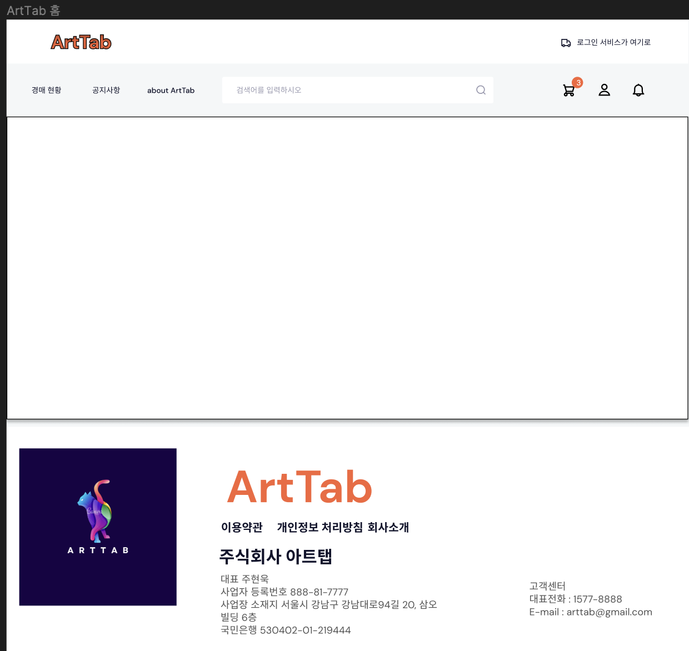
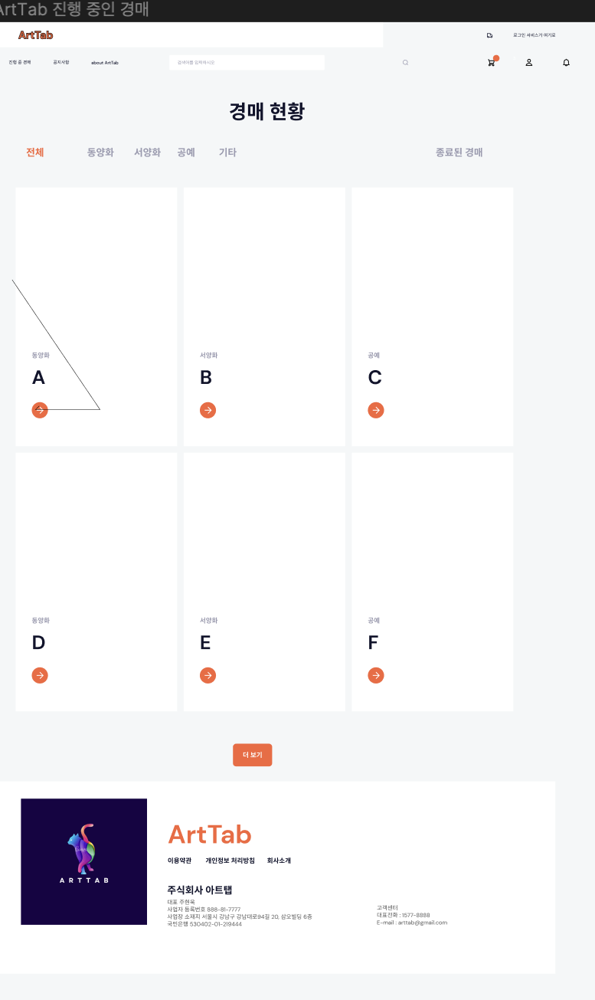
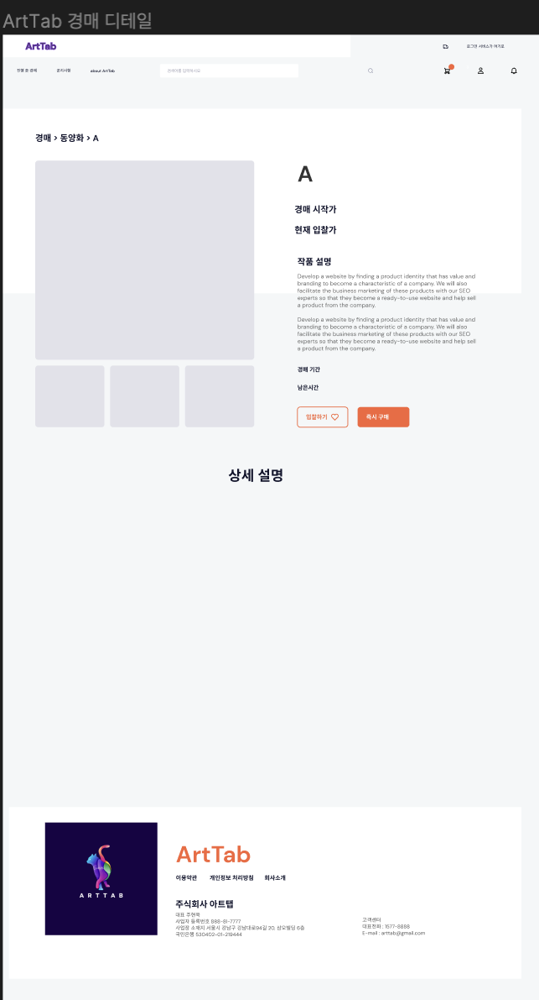
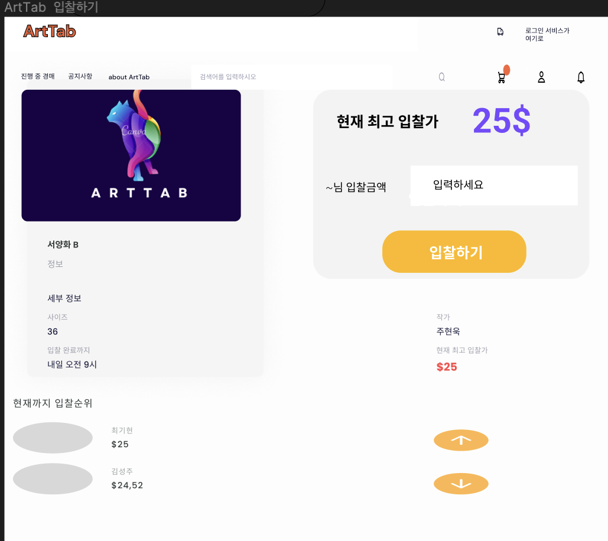
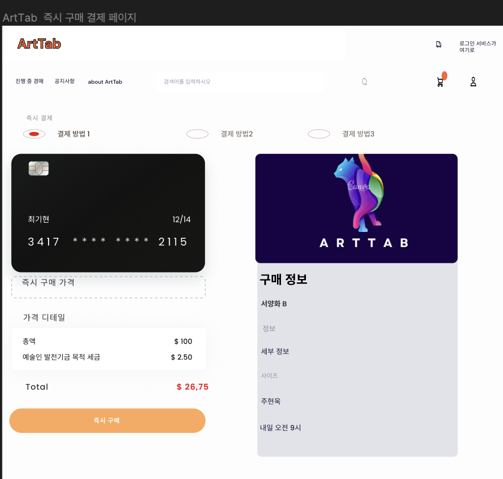

## 미술품 경매 사이트 개발 프로젝트 <a id="waving">

## 멤버
<table>
 <tr>
    <td align="center"></td>
    <td align="center"></td>
    <td align="center"></td>
    <td align="center"></td>
    <td align="center"></td>
    <td align="center"></td>
  </tr>
  <tr>
    <td align="center"><a href="https://github.com/wooki37"><b>현욱</b></a></td>
    <td align="center"><a href="https://github.com/shin2012649"><b>현우</b></a></td>
    <td align="center"><a href="https://github.com/lgsok00"><b>진석</b></a></td>
    <td align="center"><a href="https://github.com/itkw87"><b>기현</b></a></td>
    <td align="center"><a href="https://github.com/seunghyun333"><b>승현</b></a></td>
    <td align="center"><a href="https://github.com/think8521"><b>성주</b></a></td>
  </tr>
</table>

## Git
Original Repository는 회의가 끝나고 다시 Sync fork해주세요.
iml, .vscode, .idea 등의 설정파일이 레포에 업로드 되지 않도록 IDE에서 직접 작업이 아닌 파일만 가져오는 형식으로 진행해주시기 바랍니다.

1. 각자의 Remote에 현재의 Fork
2. Fork로 받아간 Repository를 자신의 Local에 Clone 및 Remote 연결
3. 작업내역에 대해서 Fork를 떠간 자신의 Remote Repository에 Push
4. 회의 전에 Original Repository / Main으로 PR을 작성
5. 레포장이 PR을 확인하고 Merge

## TechStack
### FrontEnd

### BackEnd

### Database

### Tool

## Security

---
## Architecture

## ProtoType Wire Frame

## 주요 구현 기능
- 자체 로그인 기능
- SNS 연동 로그인 기능
- 입찰 및 낙찰 확인 기능
- 작품 등록/조회/수정/삭제
- 입찰(회원)
- 즉시 구매(회원)
- 결제 기능
- 관리자 결제 취소 기능

